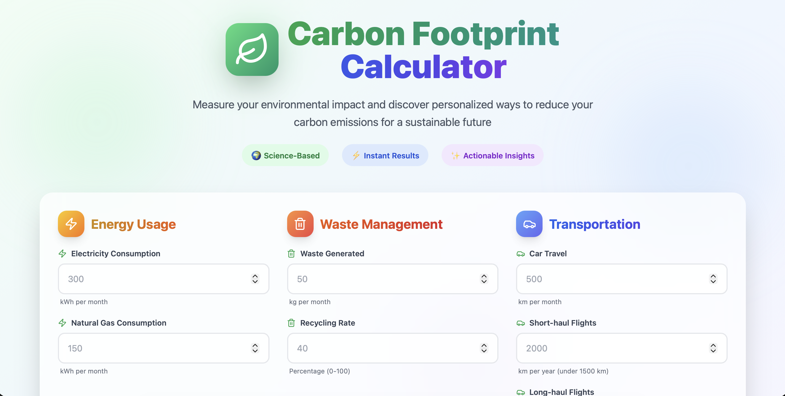

# 🌍 Carbon Footprint Tool

Measure your environmental impact and discover personalized ways to reduce your carbon emissions — for a more sustainable future.

## 🚀 Overview

The **Carbon Footprint Tool** helps users estimate their carbon emissions based on their daily activities such as energy usage, transportation, and lifestyle habits.  
It provides insights and suggestions to help users make greener choices.

## 🛠️ Tech Stack

- **Frontend:** React + TypeScript + Vite
- **Styling:** Tailwind CSS
- **Icons:** Lucide React
- **Charts:** Recharts

## 📦 Installation

1. **Clone the repository**

   ```bash
   git clone "Insert the URL"
   cd Carbon-Footprint-Tool

   ```

2. **Install dependencies**

   ```bash
   npm install

   ```

3. **Run the development server**

   ```bash
   npm run dev

   ```

4. **Open in your browser**
   ```bash
   http://localhost:5173
   ```

🌱 Features
• 🧮 Carbon footprint calculator
• ⚡ Energy, travel, and food input tracking
• 📊 Interactive charts and clean UI
• 🌍 Personalized reduction tips

📸 Preview

